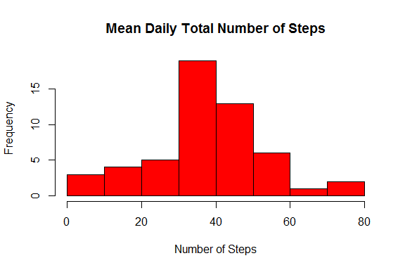
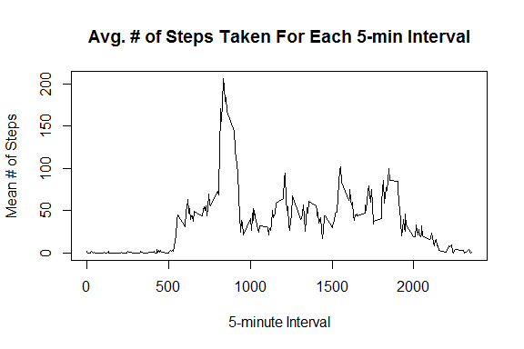

# PA1_template.Rmd
Christopher Brodowski  
May 15, 2016  

**1. Code for reading in the data set and/or processing the data**


```r
# This is code for reading and processing the data
setwd("C:/Users/cbrodows/Desktop/Coursera/ReproducibleResearch/Assignments/Assignment1/RepData_PeerAssessment1")
df <- read.csv("activity.csv")

# Get the data needed for Plots #1 and #3
unique_times <- unique(df$date)
totals <- rep(NA, length(unique_times))
for (i in 1:length(unique_times)) {
    df_sub <- df[(df$date == unique_times[i]),]
    totals_sub <- df_sub$steps[(df_sub$steps >= 0)]
    if (length(totals_sub) > 0) {
        totals[i] <- mean(totals_sub)
    }
}

# Get the data needed for Plots #2 and #3
unique_intervals <- unique(df$interval)
interval_means <- rep(NA, length(unique_intervals))
for (i in 1:length(unique_intervals)) {
    # Probably don't need to worry about floating-point equality
    # but whatever
    df_sub <- df[((df$interval >= unique_intervals[i] - 0.1) &
                  (df$interval <= unique_intervals[i] + 0.1)),]
    intervals_sub <- df_sub$steps
    if (length(intervals_sub) > 0) {
        interval_means[i] <- mean(intervals_sub, na.rm = TRUE) 
    }
}
```

**2. Histogram of the total number of steps taken each day**


```r
hist(totals, col='red', main='Mean Daily Total Number of Steps',
     xlab="Number of Steps")
```

<!-- -->

```r
print("============ Check the PA1_template_files/figure-html directory for the pics! =============")
```

```
## [1] "============ Check the PA1_template_files/figure-html directory for the pics! ============="
```

**3. Mean and median number of steps taken each day**


```r
mn <- mean(totals, na.rm = TRUE)
mn
```

```
## [1] 37.3826
```

```r
med <- median(totals, na.rm=TRUE)
med
```

```
## [1] 37.37847
```

**4. Time series plot of the average number of steps taken**


```r
plot(x=unique_intervals, y=interval_means,
         xlab="5-minute Interval",
         ylab="Mean # of Steps",
         type='l',
         col='black', main="Avg. # of Steps Taken For Each 5-min Interval"
    )
```

<!-- -->

```r
print("======== Check the PA1_template_files/figure-html directory for the pics! ===============")
```

```
## [1] "======== Check the PA1_template_files/figure-html directory for the pics! ==============="
```

**5. The 5-minute interval that, on average, contains the maximum number of steps**


```r
index <- which.max(interval_means)
max_interval <- unique_intervals[index]
max_interval
```

```
## [1] 835
```

**6. Code to describe and show a strategy for imputing missing data.**


```r
# In this case, I am taking the interval mean
new_df <- df # make new copy of data frame
for (i in 1:length(new_df[,1])) {
    if (is.na(new_df$steps[i])) {
        interval <- new_df$interval[i]
        # which interval is it?
        wanted_index <- which(unique_intervals == interval)[1]
        interval_mean <- interval_means[wanted_index]
        new_df$steps[i] <- interval_mean
    }
}
# Now, get the means of the "new" data set 
new_totals <- rep(NA, length(unique_times))
for (i in 1:length(unique_times)) {
    new_df_sub <- new_df[(new_df$date == unique_times[i]),]
    new_totals_sub <- new_df_sub$steps[(new_df_sub$steps >= 0)]
    if (length(new_totals_sub) > 0) {
        new_totals[i] <- mean(new_totals_sub)
    }
}
```

**7. Histogram of the total number of steps taken each day after removing missing values**


```r
hist(new_totals, col='blue', main='Mean Daily # Steps, NA replaced w/interval means',
         xlab="Number of Steps")
```

<!-- -->

```r
print("============== Check the PA1_template_files/figure-html directory! ======================")
```

```
## [1] "============== Check the PA1_template_files/figure-html directory! ======================"
```
